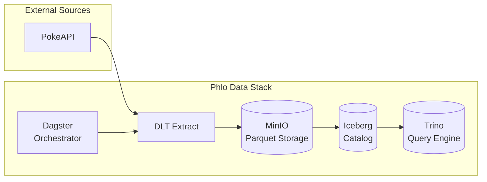

# Chapter 01 — Ingest Pokemon

Your first data pipeline: pull Pokemon data from an API into queryable Iceberg tables.

## What You'll Learn

- How `@phlo_ingestion` works — the decorator that turns a function into a managed ingestion asset.
- How DLT REST API sources connect to the decorator — you write a small helper, the decorator handles everything else.
- How data flows through the Phlo stack: **PokeAPI → DLT → Iceberg (MinIO) → Trino**.
- **Dagster** as the orchestration layer — how assets appear in the UI, how to trigger runs, and how to read run logs.

## Architecture



**Data flow:**
1. DLT fetches from PokeAPI via REST
2. Data lands as Parquet in MinIO (S3-compatible storage)
3. Iceberg catalogs the Parquet files as queryable tables
4. Trino provides SQL access to those tables
5. Dagster orchestrates the entire pipeline

## Prerequisites

Services must be running:

```bash
phlo services start
```

## Services Used in This Chapter

| Service | URL / Access | Purpose |
|---------|--------------|---------|
| Dagster | http://localhost:3000 | Materialize assets, view runs, explore lineage |
| Trino | `phlo trino --catalog iceberg --schema raw` | Query tables via SQL |
| MinIO | http://localhost:9001 (admin/admin) | Browse Parquet files in S3-compatible storage |

---

## Step 1: Create the PokeAPI Helper

DLT's `rest_api_source` is a generic connector for REST APIs. You configure it with a base URL, resource endpoints, and pagination params — DLT handles the HTTP requests and yields records.

Create `workflows/ingestion/helpers.py`:

```python
"""PokeAPI DLT helper."""

from dlt.sources.rest_api import rest_api_source


def pokeapi(resource: str, limit: int = 100):
    """Create a DLT source for a PokeAPI resource."""
    config = {
        "client": {
            "base_url": "https://pokeapi.co/api/v2/",
        },
        "resources": [
            {
                "name": resource,
                "endpoint": {
                    "path": resource,
                    "params": {"limit": limit, "offset": 0},
                    "data_selector": "results",
                },
            },
        ],
    }
    return rest_api_source(config)
```

Key points:
- `base_url` — the API root. DLT appends resource paths to this.
- `name` — becomes the DLT resource name (and maps to the table name).
- `data_selector` — PokeAPI wraps results in `{"results": [...]}`. This tells DLT where the actual records are.
- `params` — query string parameters. PokeAPI uses `limit` and `offset` for pagination.

> **Checkpoint:** Verify your helper works before continuing:
> ```bash
> python -c "from workflows.ingestion.helpers import pokeapi; src = pokeapi('pokemon', 5); print('Helper OK:', list(src)[0]['name'])"
> ```
> You should see `Helper OK: bulbasaur` (or another Pokemon name).

## Step 2: Define the Ingestion Asset

The `@phlo_ingestion` decorator wraps your function into a Dagster asset with built-in DLT loading, Iceberg storage, and freshness monitoring.

Create `workflows/ingestion/pokemon.py`:

```python
"""Pokemon ingestion assets."""

from phlo_dlt import phlo_ingestion
from workflows.ingestion.helpers import pokeapi


@phlo_ingestion(
    table_name="pokemon",
    unique_key="name",
    group="pokemon",
    cron="0 0 * * 0",
    freshness_hours=(168, 336),
    merge_strategy="merge",
)
def pokemon(partition_date: str):
    """Ingest Pokemon list from PokeAPI."""
    return pokeapi("pokemon", limit=1025)


@phlo_ingestion(
    table_name="pokemon_types",
    unique_key="name",
    group="pokemon",
    cron="0 0 1 * *",
    freshness_hours=(720, 1440),
    merge_strategy="merge",
)
def pokemon_types(partition_date: str):
    """Ingest Pokemon types."""
    return pokeapi("type", limit=20)
```

Decorator parameters explained:

| Parameter | Purpose |
|---|---|
| `table_name` | Target Iceberg table in the `raw` schema |
| `unique_key` | Deduplication key for merge operations |
| `group` | Logical grouping in the Dagster UI |
| `cron` | Schedule expression (`0 0 * * 0` = weekly Sunday) |
| `freshness_hours` | `(warn, fail)` thresholds for staleness alerts |
| `merge_strategy` | `"merge"` upserts by `unique_key`; `"append"` adds rows |

> Notice: no `validation_schema` yet — we'll add that in [Chapter 02](../02-validate-your-data/).

> **Checkpoint:** Verify your assets are discoverable:
> ```bash
> phlo assets list | grep pokemon
> ```
> You should see `dlt_pokemon` and `dlt_pokemon_types` listed. If not, check that Dagster has loaded your code (may need a service restart).

## Step 3: Materialize

You can materialize assets via the CLI or the Dagster UI. Both achieve the same result — choose whichever you prefer.

### Option A: Materialize via CLI

Run each asset individually:

```bash
phlo materialize --select dlt_pokemon
phlo materialize --select dlt_pokemon_types
```

Or materialize both in one command:

```bash
phlo materialize --select "dlt_pokemon dlt_pokemon_types"
```

Each command fetches data from the API, writes Parquet files to MinIO, and registers them as Iceberg tables.

### Option B: Materialize via Dagster UI

The Dagster UI provides a visual, interactive way to trigger and monitor materializations.

**Open the UI:**

```bash
open http://localhost:3000
```

**Materialize a single asset:**

1. Click **Assets** in the left sidebar to view the asset graph
2. Click on the `dlt_pokemon` asset to open its detail page
3. Click the **Materialize** button in the top-right corner
4. In the launchpad dialog that appears:
   - The default partition (today's date) is pre-selected
   - Leave **Materialize upstream assets** unchecked (no upstream dependencies yet)
   - Click **Materialize** to start the run
5. The dialog closes and the run begins — you'll see a notification with a link to view the run

**Materialize multiple assets at once:**

1. Navigate to **Assets** to see the full asset graph
2. Click the checkbox on each asset you want to materialize (or use the group checkbox to select all in the "pokemon" group)
3. Click the **Materialize selected** button that appears at the top
4. In the launchpad dialog, confirm your selection and click **Materialize**

**Watch the run in real-time:**

1. Click the run notification that appeared after materializing, or navigate to **Runs** in the left sidebar
2. Click on the active run to see the run detail page
3. Watch the **step timeline** as each step executes (DLT fetch → validation → Iceberg write)
4. Click any step to see its **structured logs** in real-time — useful for debugging if something fails
5. The run status changes from "Started" → "Success" as each step completes

**Refresh partitions if needed:**

If you see "No partitions available" in the launchpad:

1. Navigate to **Deployment** → **Daemons** in the left sidebar
2. Verify the sensor daemon is running (status should be "Healthy")
3. Return to the asset and try materializing again
4. If still unavailable, use the CLI which handles partition selection automatically

> **Tip:** The UI is especially helpful when you're learning — you can see exactly what happens at each step. The CLI is faster once you're comfortable. Use whichever fits your workflow.

## Step 4: Explore Results in the Dagster UI

Every `@phlo_ingestion` function becomes a **Dagster asset** — a unit of data that Dagster tracks, schedules, and monitors. If you haven't opened the UI yet:

```bash
open http://localhost:3000
```

### Asset graph

Click **Assets** in the left sidebar. You should see your two assets: `dlt_pokemon` and `dlt_pokemon_types`, grouped under "pokemon" (the `group` parameter you set in the decorator).

Click on `dlt_pokemon` to see its detail page:

| Section | What it shows |
|---|---|
| **Materialization history** | Every time the asset was materialized — timestamps, duration, status |
| **Metadata** | Row count, schema, table location in Iceberg |
| **Freshness** | Current staleness vs. the `freshness_hours` thresholds you configured |
| **Upstream / Downstream** | Dependencies between assets (none yet — we'll add them in Chapter 03) |

### Run details

Click **Runs** in the left sidebar. Find your materialization run and click into it to see:

- **Step timeline** — each step as a bar chart
- **Logs** — structured output from the pipeline (filter by level)
- **Asset materializations** — which assets were created/updated

### Schedules and sensors

Click **Automation** → **Schedules**. Your `cron` parameter (`0 0 * * 0` for weekly) is registered here. Dagster materializes assets automatically once the daemon is running.

> **Tip:** Leave the Dagster UI open as you work through the workshop — it's the control plane for everything.

## Step 5: Query in Trino

Connect to Trino and inspect your data:

```bash
phlo trino --catalog iceberg --schema raw
```

```sql
SELECT name, url FROM pokemon LIMIT 10;
```

```sql
SELECT COUNT(*) FROM pokemon;
```

```sql
SELECT name, url FROM pokemon_types LIMIT 10;
```

Type `quit` to exit.

## Step 6: Check Your Work

Run the checkpoint script to verify everything landed correctly:

```bash
python chapters/01-ingest-pokemon/check.py
```

Expected output:

```
Chapter 01 — Ingest Pokemon

  ✓ pokemon: 1025 rows
  ✓ pokemon_types: 20 rows

All checks passed!
```

## What You Built

Here's what happened end-to-end:

1. **DLT** fetched records from `https://pokeapi.co/api/v2/pokemon` and `/type`.
2. `@phlo_ingestion` loaded those records into **Iceberg tables** stored in **MinIO** (S3-compatible object storage).
3. **Trino** can query those tables via the Iceberg catalog — no extra setup needed.
4. **Dagster** tracks and schedules everything — assets, runs, freshness, and dependencies are all visible in the UI at `localhost:3000`.

You wrote ~30 lines of Python. Phlo handled schema inference, storage, cataloging, scheduling, and orchestration.

**Key concepts to remember for later chapters:**
- `@phlo_ingestion` creates Dagster assets with built-in partitioning and scheduling
- Data flows: Source → DLT → MinIO → Iceberg → Trino
- The Dagster UI is your control plane for materialization, monitoring, and debugging

## Next

→ [Chapter 02 — Validate Your Data](../02-validate-your-data/) — Add data validation with Pandera schemas to ensure data quality before it reaches your lakehouse.
