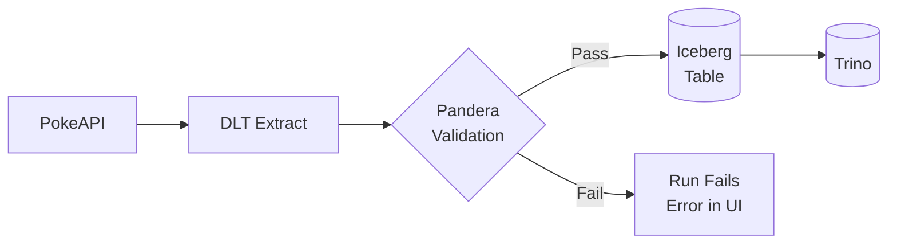

# Chapter 02 — Validate Your Data

Add Pandera schemas to your ingestion assets so data is validated before it lands in Iceberg.

## What You'll Learn

- Defining Pandera schemas with `PhloSchema` — the base class that bridges Pandera validation to Phlo's ingestion pipeline.
- Adding `validation_schema` to `@phlo_ingestion` — one parameter wires schema checks into the asset.
- Quality check types — what happens when validation fails and how to debug it in the Dagster UI.

## Architecture

Validation happens during the DLT → Iceberg flow, before data is committed:



**Validation flow:**
1. DLT extracts data from the source
2. Pandera validates every record against your schema
3. If validation passes: data is written to Iceberg
4. If validation fails: the run stops and the error appears in Dagster

## Prerequisites

Chapter 01 complete — `pokemon` and `pokemon_types` tables exist in Trino. See [Chapter 01](../01-ingest-pokemon/) if you haven't completed it.

## Services Used in This Chapter

| Service | URL / Access | Purpose |
|---------|--------------|---------|
| Dagster | http://localhost:3000 | View validation errors in run logs |
| Trino | `phlo trino --catalog iceberg --schema raw` | Verify tables still work with validation |

---

## Step 1: Define a Schema

Create `workflows/schemas/pokemon.py`:

```python
"""Pokemon Pandera schemas."""

from pandera.pandas import Field
from phlo_pandera.schemas import PhloSchema


class RawPokemon(PhloSchema):
    """Raw Pokemon data from PokeAPI."""

    name: str = Field(description="Pokemon name")
    url: str = Field(description="API URL for full details")


class RawPokemonTypes(PhloSchema):
    """Pokemon types from PokeAPI."""

    name: str = Field(description="Type name (fire, water, grass, etc.)")
    url: str = Field(description="API URL for full details")
```

Key points:

| Concept | What it does |
|---|---|
| `PhloSchema` | Base class — extends Pandera's `DataFrameModel` with Phlo defaults (coerce types, reject unknown columns, etc.) |
| `Field(description=...)` | Column-level metadata. Descriptions flow into catalogs and docs. You can also add constraints like `ge=`, `le=`, `isin=`. |
| Class name | Referenced by `validation_schema` in the decorator — connects schema to asset. |

> **Checkpoint:** Verify your schemas are valid Python:
> ```bash
> python -c "from workflows.schemas.pokemon import RawPokemon; print('Schema OK:', RawPokemon.__name__)"
> ```
> If this fails, check your imports and class syntax. |

## Step 2: Wire Schema to Ingestion

Update `workflows/ingestion/pokemon.py` to import the schemas and pass them to the decorators:

```python
from workflows.schemas.pokemon import RawPokemon, RawPokemonTypes

@phlo_ingestion(
    table_name="pokemon",
    unique_key="name",
    validation_schema=RawPokemon,   # ← add this
    ...
)

@phlo_ingestion(
    table_name="pokemon_types",
    unique_key="name",
    validation_schema=RawPokemonTypes,  # ← add this
    ...
)
```

That's it. The decorator validates each batch of records against the schema before writing to Iceberg.

## Step 3: Re-materialize

Re-materialize the Pokemon asset to apply validation:

```bash
phlo materialize --select dlt_pokemon
```

Or use the Dagster UI — see [Chapter 1 Step 3](../01-ingest-pokemon/#step-3-materialize) for detailed UI instructions.

Data is now validated before writing. If the schema matches, everything works exactly as before — you've just added a safety net.

## Step 4: Break It on Purpose

Edit your schema to add an impossible constraint — for example, a numeric check on a string field:

```python
class RawPokemon(PhloSchema):
    name: str = Field(ge=1, description="Pokemon name")  # ge=1 on a string — will fail
    url: str = Field(description="API URL for full details")
```

Materialize again to trigger the failure:

```bash
phlo materialize --select dlt_pokemon
```

Or use the Dagster UI.

The run will fail. Open the Dagster UI (`http://localhost:3000`) to see the validation error with details about which column and check failed.

Fix the schema (remove `ge=1`) and re-materialize to confirm it passes again.

## Step 5: Check Your Work

```bash
python chapters/02-validate-your-data/check.py
```

Expected output:

```text
Chapter 02 — Validate Your Data

  ✓ pokemon: 1025 rows
  ✓ pokemon_types: 20 rows

All checks passed!
```

## What You Built

You added **data validation** to your pipeline with ~10 lines of schema code. Every materialization now checks that incoming data matches your expected shape before it reaches Iceberg.

**Key concepts for later chapters:**
- `PhloSchema` provides the foundation for all data contracts in Phlo
- Validation failures surface in the Dagster UI with detailed column-level errors
- Schemas are enforced at write time, not query time — bad data never lands

## Next

→ [Chapter 03 — Transform with dbt](../03-transform-with-dbt/) — Build a medallion architecture with bronze (raw), silver (cleaned), and gold (enriched) tables using dbt models on Trino/Iceberg.
