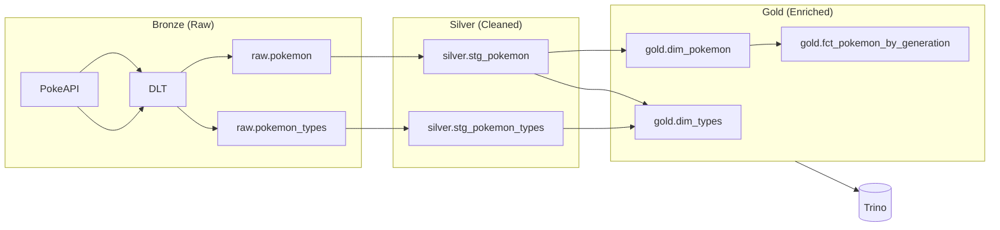

# Chapter 03 — Transform with dbt

Shape raw data into analytics-ready tables using dbt on Trino/Iceberg.

## What You'll Learn

- **Medallion architecture** — raw → silver (staged/cleaned) → gold (enriched/aggregated).
- **dbt models on Trino/Iceberg** — how dbt compiles SQL and materializes tables via Trino.
- **dbt + Dagster integration** — Dagster discovers dbt models as assets automatically.

## Architecture

The medallion architecture organizes data into quality tiers:



**Data quality progression:**
- **Bronze:** Raw ingestion from sources (landed as-is)
- **Silver:** Cleaned, typed, deduplicated staging tables
- **Gold:** Business-ready dimensions and facts for analytics

## Prerequisites

Chapters 01 complete — `raw.pokemon` and `raw.pokemon_types` tables must exist in Trino. See [Chapter 01](../01-ingest-pokemon/) for the ingestion setup.

## Services Used in This Chapter

| Service | URL / Access | Purpose |
|---------|--------------|---------|
| Dagster | http://localhost:3000 | View dbt models as assets, track lineage |
| Trino | `phlo trino --catalog iceberg` | Query silver and gold tables |
| dbt docs | Generated after run | View model documentation and lineage |

---

## Step 1: Set Up the dbt Project

Create `workflows/transforms/dbt/dbt_project.yml`:

```yaml
name: "workshop_transforms"
version: "1.0.0"

profile: "workshop_transforms"

model-paths: ["models"]
analysis-paths: ["analyses"]
test-paths: ["tests"]
seed-paths: ["seeds"]
macro-paths: ["macros"]
snapshot-paths: ["snapshots"]

clean-targets:
  - "target"
  - "dbt_packages"
```

Create `workflows/transforms/dbt/profiles/profiles.yml`:

```yaml
workshop_transforms:
  target: dev
  outputs:
    dev:
      type: trino
      method: none
      host: "{{ env_var('TRINO_HOST', 'localhost') }}"
      port: "{{ env_var('TRINO_PORT', '8080') | int }}"
      catalog: iceberg
      schema: silver
      user: trino
      http_scheme: http
      threads: 4
```

Key points:
- **profile** must match between `dbt_project.yml` and `profiles.yml`.
- **catalog: iceberg** — dbt writes tables to the Iceberg catalog.
- **schema: silver** — the default schema. Models can override this with `config(schema='gold')`.
- **type: trino** — dbt-trino adapter handles Trino SQL dialect.

> **Checkpoint:** Verify your dbt project is configured correctly:
> ```bash
> phlo dbt debug
> ```
> You should see "Connection test: OK" for the Trino connection.

## Step 2: Define Sources

Create `workflows/transforms/dbt/models/sources.yml` pointing to the raw tables from Chapter 01:

```yaml
version: 2

sources:
  - name: dagster_assets
    database: "{{ target.catalog }}"
    schema: raw
    tables:
      - name: pokemon
        description: Raw Pokemon data from PokeAPI
      - name: pokemon_types
        description: Raw Pokemon types from PokeAPI
```

The `{{ target.catalog }}` resolves to `iceberg` from your profile. The `schema: raw` tells dbt these tables live in `iceberg.raw.*`.

## Step 3: Write Silver Models (Staging)

Silver models clean and standardize raw data. They're the "single source of truth" that gold models build on.

Create `workflows/transforms/dbt/models/silver/stg_pokemon.sql`:

```sql
{{
    config(
        materialized='table',
        schema='silver'
    )
}}

WITH source AS (
    SELECT * FROM {{ source('dagster_assets', 'pokemon') }}
),

staged AS (
    SELECT
        CAST(
            REGEXP_EXTRACT(url, '/pokemon/(\d+)/', 1) AS INTEGER
        ) AS pokemon_id,
        LOWER(TRIM(name)) AS pokemon_name,
        url AS api_url,
        _phlo_ingested_at,
        _phlo_partition_date
    FROM source
    WHERE name IS NOT NULL
)

SELECT * FROM staged
```

Create `workflows/transforms/dbt/models/silver/stg_pokemon_types.sql`:

```sql
{{
    config(
        materialized='table',
        schema='silver'
    )
}}

WITH source AS (
    SELECT * FROM {{ source('dagster_assets', 'pokemon_types') }}
),

staged AS (
    SELECT
        CAST(
            REGEXP_EXTRACT(url, '/type/(\d+)/', 1) AS INTEGER
        ) AS type_id,
        LOWER(TRIM(name)) AS type_name,
        url AS api_url,
        _phlo_ingested_at
    FROM source
    WHERE name IS NOT NULL
)

SELECT * FROM staged
```

Staging patterns:
- **Extract IDs** from URLs using `REGEXP_EXTRACT` — the raw data only has URLs.
- **Clean names** with `LOWER(TRIM(...))` for consistent downstream joins.
- **Filter nulls** early so gold models don't need to.
- **Rename** raw columns to domain-specific names (`url` → `api_url`).

## Step 4: Write Gold Models (Dimensions & Facts)

Gold models enrich data for analytics. Dimensions describe entities; facts aggregate metrics.

Create `workflows/transforms/dbt/models/gold/dim_pokemon.sql`:

```sql
{{
    config(
        materialized='table',
        schema='gold'
    )
}}

WITH pokemon AS (
    SELECT * FROM {{ ref('stg_pokemon') }}
),

enriched AS (
    SELECT
        pokemon_id,
        pokemon_name,
        CASE
            WHEN pokemon_id <= 151 THEN 1
            WHEN pokemon_id <= 251 THEN 2
            WHEN pokemon_id <= 386 THEN 3
            WHEN pokemon_id <= 493 THEN 4
            WHEN pokemon_id <= 649 THEN 5
            WHEN pokemon_id <= 721 THEN 6
            WHEN pokemon_id <= 809 THEN 7
            WHEN pokemon_id <= 905 THEN 8
            ELSE 9
        END AS generation,
        CASE
            WHEN pokemon_id <= 151 THEN 'Kanto'
            WHEN pokemon_id <= 251 THEN 'Johto'
            WHEN pokemon_id <= 386 THEN 'Hoenn'
            WHEN pokemon_id <= 493 THEN 'Sinnoh'
            WHEN pokemon_id <= 649 THEN 'Unova'
            WHEN pokemon_id <= 721 THEN 'Kalos'
            WHEN pokemon_id <= 809 THEN 'Alola'
            WHEN pokemon_id <= 905 THEN 'Galar'
            ELSE 'Paldea'
        END AS region,
        api_url,
        _phlo_ingested_at AS loaded_at
    FROM pokemon
)

SELECT * FROM enriched
ORDER BY pokemon_id
```

Create `workflows/transforms/dbt/models/gold/dim_types.sql` and `fct_pokemon_by_generation.sql` — see the starter files for TODOs.

Gold patterns:
- **`{{ ref('stg_pokemon') }}`** — references silver models, creating a dependency graph.
- **Derived columns** — `generation` and `region` are computed from ID ranges.
- **Fact tables** aggregate dimensions — `fct_pokemon_by_generation` groups by generation with counts and percentages.

## Step 5: Run dbt

Execute all dbt models:

```bash
phlo dbt run \
  --select "stg_pokemon stg_pokemon_types dim_types dim_pokemon fct_pokemon_by_generation"
```

`phlo dbt` runs dbt in the Dagster service by default, so you do not need to know the
container name, compose project, or dbt project paths.

dbt compiles your SQL, runs it against Trino, and creates Iceberg tables in `silver` and
`gold` schemas.

## Step 6: Query Gold Tables

Connect to Trino and explore your transformed data:

```bash
phlo trino --catalog iceberg --schema gold
```

```sql
SELECT * FROM dim_pokemon LIMIT 10;
```

```sql
SELECT * FROM fct_pokemon_by_generation;
```

```sql
SELECT * FROM dim_types;
```

Type `quit` to exit.

## Step 7: Check Your Work

```bash
python chapters/03-transform-with-dbt/check.py
```

Expected output:

```
Chapter 03 — Transform with dbt

  ✓ silver.stg_pokemon: 1025 rows
  ✓ silver.stg_pokemon_types: 20 rows
  ✓ gold.dim_pokemon: 1025 rows
  ✓ gold.fct_pokemon_by_generation: 9 rows

All checks passed!
```

## What You Built

1. **dbt project** configured to run SQL against Trino/Iceberg.
2. **Silver layer** — cleaned, typed staging tables from raw data.
3. **Gold layer** — enriched dimensions and aggregated facts ready for analytics.
4. **Dependency graph** — `raw → silver → gold`, tracked by dbt and visible in Dagster.

You wrote ~80 lines of SQL. dbt handled compilation, execution, and table materialization.

**Key concepts for later chapters:**
- Medallion architecture (bronze/silver/gold) organizes data by quality and readiness
- dbt models are automatically Dagster assets — lineage flows through the entire graph
- Sources (`{{ source() }}`) and refs (`{{ ref() }}`) create an explicit dependency graph

## Next

→ [Chapter 04 — Explore in pgweb](../04-explore-in-pgweb/) — Query your gold tables through a web-based Postgres explorer connected to Phlo's metadata store.
