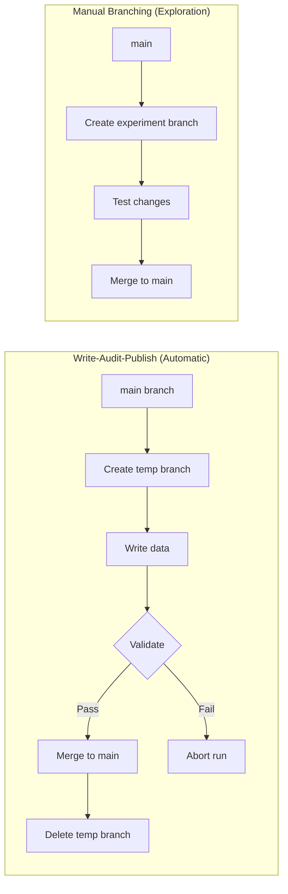

# Chapter 07 — Branch Your Data

**What you'll learn:** How Phlo's orchestrator uses Nessie branches automatically for safe data updates, and how to explore those branches via CLI and Dagster UI.

**Time:** ~15 minutes

---

## Prerequisites

- Chapters 01–02 complete (Pokemon data ingested and validated)
- Services running (`phlo services start`)

---

## Background

Nessie is a git-like catalog for your data lakehouse. Just as Git lets you branch code, Nessie lets you branch *data*.

**How Phlo uses Nessie:**



| What happens | How it's done |
|---|---|
| Every pipeline run | Orchestrator creates a temporary branch automatically |
| Data validation | Runs on the temporary branch (isolated from main) |
| After validation passes | Orchestrator merges the branch to main |
| You see the result | Data appears on main, ready to query |

This is Phlo's **Write-Audit-Publish (WAP)** pattern. It happens automatically when you materialize assets — you don't manage branches manually in day-to-day work.

**When you might use branches directly:**

- **Debugging** — inspect what the orchestrator created
- **Experimentation** — test changes in isolation without triggering a full pipeline run
- **Understanding** — see how the pieces fit together

This chapter shows you the CLI commands for exploring branches. In production, your orchestrator (Dagster) handles all of this for you.

## Prerequisites

- Chapters 01–02 complete (Pokemon data ingested and validated)
- Services running (`phlo services start`)

## Services Used in This Chapter

| Service | URL / Access | Purpose |
|---------|--------------|---------|
| Nessie API | `phlo nessie branch list` | CLI for branch operations |
| Dagster | http://localhost:3000 | Trigger materializations to see WAP in action |
| Trino | `phlo trino query "SELECT ..."` | Verify data on main branch |

---

## Step 1 — List branches the orchestrator uses

See what branches exist. You'll see `main` (production) and possibly WAP temporary branches:

```bash
phlo nessie branch list
```

You should see at minimum a single `main` branch — the default reference for all catalog operations.

---

## Step 2 — Create an experiment branch

Create a branch for experimentation (separate from the orchestrator's WAP branches):

```bash
phlo nessie branch create workshop-experiment
```

```
✓ Created branch: workshop-experiment
  From: main
  Head: a1b2c3d4
```

Verify it appears:

```bash
phlo nessie branch list
```

You should now see both `main` and `workshop-experiment`.

> **Checkpoint:** Confirm your branch is based on the expected commit:
> ```bash
> phlo nessie branch show workshop-experiment
> ```
> The commit hash should match what `phlo nessie branch show main` displays.

---

## Step 3 — Trigger a materialization

Materialize an asset to see WAP in action:

```bash
phlo materialize --select dlt_pokemon
```

Or use the Dagster UI — see [Chapter 1 Step 3](../01-ingest-pokemon/#step-3-materialize) for detailed UI instructions.

The orchestrator handles WAP automatically: it creates a temporary branch, writes data, validates, and merges to main. You don't see the temporary branch in normal operation — it's cleaned up after the merge.

> **Note:** The `workshop-experiment` branch you created is separate from WAP. It captured a snapshot of main at creation time and won't receive the new data unless you specifically write to it.

---

## Step 4 — Diff against main

Compare your experiment branch to main:

```bash
phlo nessie branch diff workshop-experiment main
```

If you haven't made changes directly on `workshop-experiment`, the diff will show no differences on that branch. After the materialization in Step 3 landed new commits on main, the diff may show tables that were modified on main since the branch was created.

---

## Step 5 — Merge the branch

Merge your experiment branch back into main:

```bash
phlo nessie branch merge workshop-experiment main
```

```
✓ Merged workshop-experiment into main
✓ Deleted source branch: workshop-experiment
```

By default, the source branch is deleted after merge. Use `--no-delete-source` to keep it, or `--dry-run` to preview:

```bash
phlo nessie branch merge workshop-experiment main --dry-run
```

---

## Step 6 — Verify in Trino

Confirm the Pokemon data is available on main via Trino:

```bash
phlo trino query "SELECT COUNT(*) FROM iceberg.raw.pokemon"
```

You should see a count of 100+ rows.

---

## Step 7 — Check your work

Run the chapter checkpoint:

```bash
python chapters/07-branch-your-data/check.py
```

You should see:

```
Chapter 07 — Branch Your Data

  ✓ Nessie API is reachable
  ✓ main branch: pokemon has 151 rows

All checks passed!
```

---

## Summary

You now know:

- **Nessie** provides git-like branching for your data catalog
- **WAP pattern** — your orchestrator handles branches automatically on every materialization (from [Chapter 1](../01-ingest-pokemon/))
- **CLI commands** (`phlo nessie branch create/list/diff/merge`) let you explore and experiment with branches directly
- **In production** — rely on the orchestrator; manual branching is for debugging and experimentation only

**Key concepts for later chapters:**
- Branching enables isolated testing before data reaches production
- WAP ensures bad data never lands on main — it's validated in isolation first
- Nessie branches are lightweight — you can create them freely for experiments

## Next

→ [Chapter 08 — Alerting & the Hook Bus](../08-alerting-and-hooks/) — Configure Slack, PagerDuty, or email alerts that fire when quality checks fail or pipelines error out.
